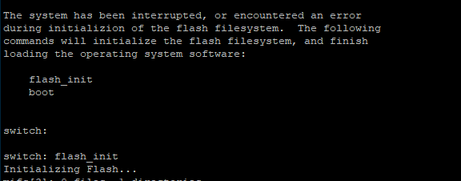
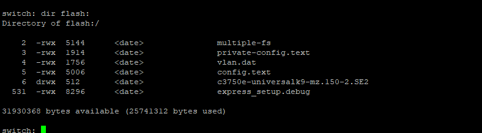
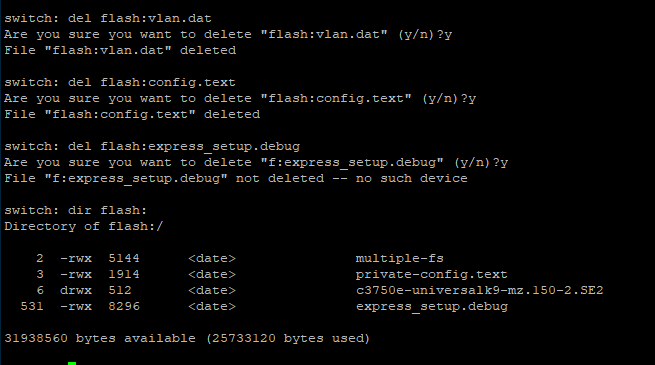

# **CHEATSHIT CISCO**

- [**CHEATSHIT CISCO**](#cheatshit-cisco)
  - [**Reset**](#reset)
    - [**Reset : Phase Hardware**](#reset--phase-hardware)
    - [**Reset : Phase Software**](#reset--phase-software)
  - [**Remettre la GUI**](#remettre-la-gui)
    - [**GUI :**](#gui-)

-----------------------------

## **Reset**

### **Reset : Phase Hardware**
Pour reset un cisco, la plus part du temps,

- Lancez Putty avoir le port serie 
- Appuyez sur le bouton et brancher l'alimentation
- Restez appuyer jusqu'à avoir l'image suivante :


- Lâchez le bouton
- Passez à la phase suivante


### **Reset : Phase Software**

- Faites la commande suivante :
```
flash_init
```
- Faites la commande suivante pour voir les fichiers :
```
dir flash:
```


- Faites la commande suivante pour supprimer les fichiers :
```
del flash:nomdufichier
```
 - Supprimez les fichiers suivants : 
   - config.text
   - config.text.backup
   - private-config.text.backup
   - vlan.dat




- Faites la commande suivante pour boot :
```
boot
```

- VOILA LE SWITCH EST RESET

--------------------------

## **Remettre la GUI**

### **GUI :**
- Allez sur cisco register votre switch à l'adresse suivante : [ICI](https://cloudsso.cisco.com/as/authorization.oauth2?response_type=code&client_id=wam_prod_ac&redirect_uri=https%3A%2F%2Fsoftware.cisco.com%2Fpa%2Foidc%2Fcb&state=eyJ6aXAiOiJERUYiLCJhbGciOiJkaXIiLCJlbmMiOiJBMTI4Q0JDLUhTMjU2Iiwia2lkIjoiZHMiLCJzdWZmaXgiOiJlWHpONTQuMTY0NzYxMDIyMCJ9..BbSBhsqZP6XJw_RU18XLZA.ak5fILOOW6xXHOYIzRPntbQIuskN61v4cVul7odqn4_NBBtNJwTHO1vkGbIQe6uZdJWL9fCiCnl2xV3E4Sy-Z45rSJhX7hrgIHOY-ZW210Q.pJe_2XPK9FYQHBeBtQ5U9g&nonce=R6N_ZlpmUbU6EMqS_6O-xGpMgDX6DZdCs-aTzYCWn6k&acr_values=stdnomfa&scope=openid%20profile%20address%20email%20phone&vnd_pi_requested_resource=https%3A%2F%2Fsoftware.cisco.com%2Fsoftware%2Fswift%2Flrp%2F&vnd_pi_application_name=CAEAXprod-software#/devices)
- Entrez un nouvel équipement
- Selectionnez PID/SN
- Rentrez votre PID (il est de la forme WS-........)
- Rentrez le SN (il est marqué sur l'étiquette SN)
- Allez ensuite [ICI](https://software.cisco.com/download/home) et selectionnez votre switch
- Prenez la version suivante (WITH WEB BASE) :

- Mettez ce fichier dans une clef usb et branchez là au switch
- Avec Putty allez sur la console
- Rentrez la commande suivante pour untar le fichier dans le switch (NE LE COPIEZ PAS DEDANS) :
```
FORME : archive tar /xtract <tar file name> <Dir to extract files>
```
Exemple :
```
archive tar /xtract flashusb0:c3750-advipservicesk9-tar.122-25.SEE1.tar flash:
```
- Une fois téléchargé, changez le boot system :

```
conf t
boot system switch all flash:c3750-
advipservicesk9-mz.122-25.SEE1/c3750-advipservicesk9-mz.122-25.SEE1.bin
ex
write memory
reload
```

VOILA VOUS AVEZ ACCES A VOTRE GUI

----------------

