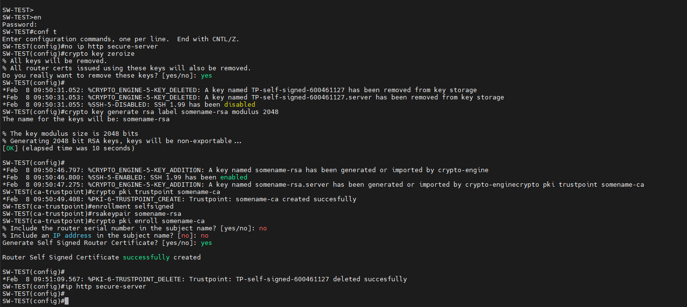

## **Générer un certificat auto-signé**

1 - Desactiver l'interface Web

```
no ip http secure-server
```

2 - Supprimer tout les certificats actif sur le switch

```
crypto key zeroize
```

3 - Générer un certificat en RSA 2048

```
crypto key generate rsa label somename-rsa modulus 2048
```

4 - Exécuter les commandes suivantes :

```
crypto pki trustpoint somename-ca

                     enrollment selfsigned

                     rsakeypair somename-rsa
```

5 - Appliquer le certificat

```
crypto pki enroll somename-ca
```

-> no
-> no
-> yes

6 - Reactiver l'interface Web

```
ip http secure-server
```

• Résultat :


